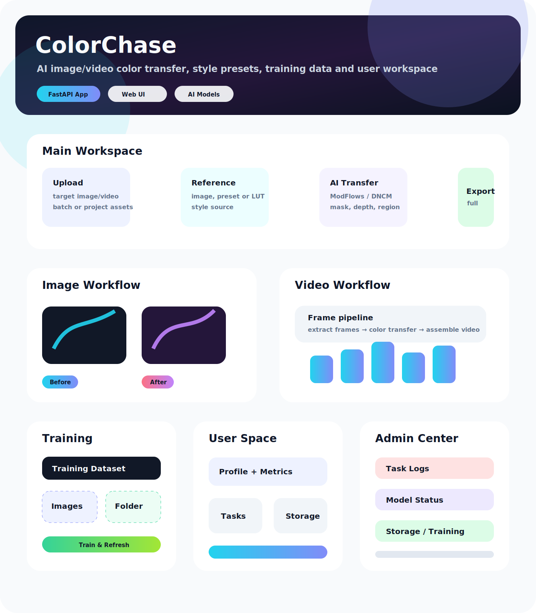
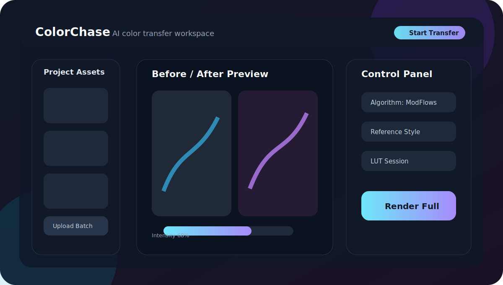
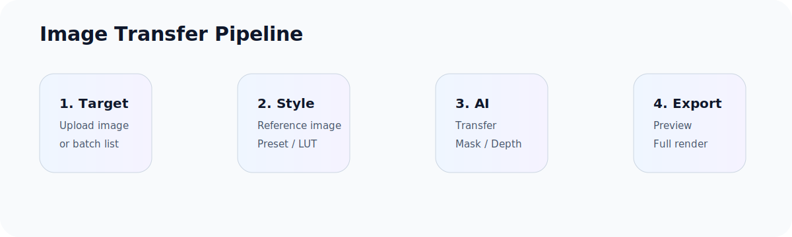
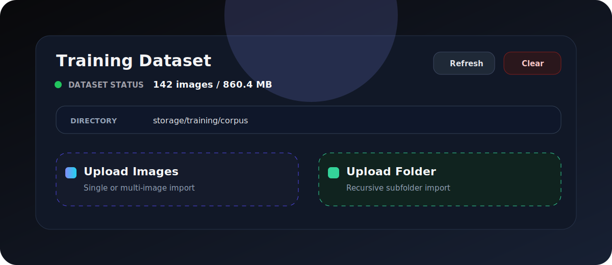
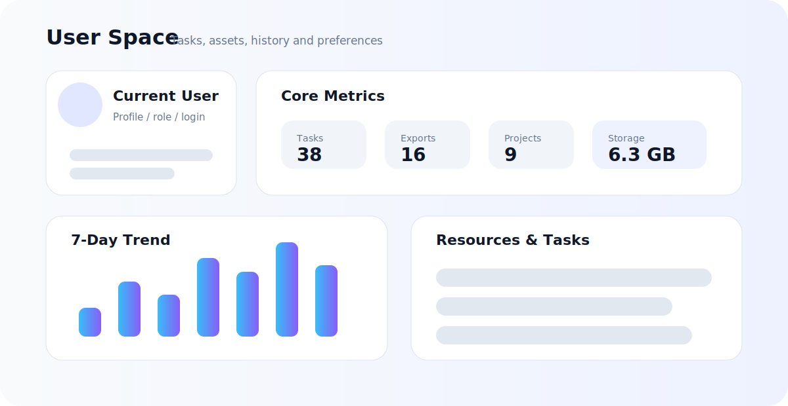

# ColorChase

**正式在线服务：** [https://colorchase.meiyoutou.top/](https://colorchase.meiyoutou.top/)

**静态前端预览：** [https://meiyoutou.github.io/ColorChase/](https://meiyoutou.github.io/ColorChase/)

该预览页只展示前端界面与交互 mock 数据，不连接生产后端。

ColorChase 是一个基于 FastAPI 的图像/视频追色与风格管理工具，集成经典颜色迁移、LUT、ModFlows、DNCM、NeuralPreset、Depth Anything V2、SAM2、BiRefNet、DINOv2 等能力，用于图片追色、视频追色、风格预设、训练样本管理和项目资产管理。

## 图像化功能使用教程



## 产品界面概览



HTML 展示稿可直接打开查看：[docs/assets/colorchase-showcase.html](docs/assets/colorchase-showcase.html)

## 图片追色流程



## 训练数据面板



## 个人空间概览



## 项目结构

```text
ColorChase/
├── main.py                      # FastAPI 入口，保留追色主流程和少量未拆分路由
├── auth.py                      # JWT 鉴权与 Cookie 配置
├── config.py                    # 路径常量、运行时目录、模型路径
├── database.py                  # SQLAlchemy async session
├── models.py                    # ORM 模型
├── progress.py                  # 任务进度管理
├── admin_runtime_metrics.py     # 运行时统计、任务日志
├── requirements.txt
├── .env.example
│
├── app/
│   ├── routes/                  # 已拆分路由
│   │   ├── auth.py
│   │   ├── projects.py          # 项目、个人空间、资产统计
│   │   ├── training.py          # 模型训练与训练数据上传
│   │   ├── task.py              # 任务暂停/恢复/取消、用户配置
│   │   ├── analysis.py          # 景深、语义、主体分析
│   │   ├── files.py             # 文件读取路由
│   │   ├── styles.py            # 风格列表、重命名、应用
│   │   ├── lut.py               # LUT 合并、Lightroom 预设导出
│   │   ├── video_export.py      # 视频导出、视频元数据
│   │   ├── admin.py             # 管理员概览
│   │   ├── admin_models.py      # 模型管理
│   │   ├── model_status.py      # 模型状态
│   │   ├── progress.py          # SSE 进度
│   │   └── style_capture.py     # 风格采集
│   ├── services/
│   │   ├── paths.py             # 路径解析、安全目录、项目资产
│   │   ├── auth_utils.py        # 请求 Token/用户解析
│   │   ├── model_management.py  # 模型启用、禁用、默认模型
│   │   ├── task_logging.py      # 任务日志写入
│   │   └── training_corpus.py   # 训练样本副本管理
│   ├── security.py              # 上传大小、频率限制、AI 并发限制
│   └── settings.py              # 环境、CORS/Host、时区
│
├── algorithms/                  # 算法实现
│   ├── color_transfer.py
│   ├── depth_layers.py
│   ├── semantic_match.py
│   ├── subject_mask.py
│   ├── dncm/
│   ├── neural_preset/
│   ├── neuralpreset/
│   ├── metrics/
│   └── video/
│
├── core/
│   ├── color/lut_ops.py         # LUT 计算
│   ├── io/image_utils.py        # 上传保存、OpenCV 读图、base64
│   ├── io/lut_session.py        # LUT session 落盘
│   ├── io/loaders.py
│   └── render/full_render.py
│
├── static/                      # 前端页面、JS、CSS、图片资源
├── deploy/                      # Nginx/Caddy 部署配置
├── docs/                        # 运行、结构、安全、GitHub 上传文档
├── scripts/                     # 维护脚本和 GitHub 预检脚本
├── tests/                       # 测试与 fixtures
└── presets/                     # 内置预设
```

## 运行时目录

默认运行时数据统一放在 `storage/` 下：

```text
storage/
├── cache/                       # model_management.json、运行时统计
├── logs/debug_output/           # 调试输出
├── projects/assets/             # 项目资产
├── styles/extracted/            # 风格抽取结果
├── temp/luts/                   # LUT/session 临时文件
├── temp/frames/                 # 视频抽帧临时文件
├── training/corpus/             # 训练数据
├── uploads/images/              # 非项目图片上传
├── uploads/videos/              # 非项目视频上传
├── users/local_user/            # 本地用户资源
└── videos/                      # 非项目视频结果
```

这些目录属于运行时数据，默认被 `.gitignore` 排除。

## 本地开发

建议使用 Python 3.10 或 3.12，并优先使用虚拟环境。

```bash
python -m venv .venv312
.venv312\Scripts\activate
pip install -r requirements.txt
```

复制环境变量模板：

```bash
copy .env.example .env
```

必须设置：

```env
COLORCHASE_SECRET_KEY=replace-with-a-long-random-secret
COLORCHASE_ENV=development
```

启动服务：

```bash
python main.py
```

默认监听：

```text
http://127.0.0.1:8000
```

也可以直接使用 uvicorn：

```bash
uvicorn main:app --host 127.0.0.1 --port 8000
```

## 关键环境变量

| 变量 | 说明 |
|---|---|
| `COLORCHASE_ENV` | `development` 或 `production` |
| `COLORCHASE_SECRET_KEY` | JWT 密钥，必须设置 |
| `COLORCHASE_ALLOWED_ORIGINS` | 追加 CORS origin，默认已包含生产站和 GitHub Pages |
| `COLORCHASE_ALLOWED_HOSTS` | 生产 Host 白名单 |
| `COLORCHASE_UPLOAD_MAX_BYTES` | 通用上传限制 |
| `COLORCHASE_IMAGE_ORIGINAL_UPLOAD_MAX_BYTES` | 原图/训练图上传限制 |
| `COLORCHASE_VIDEO_UPLOAD_MAX_BYTES` | 视频上传限制 |
| `COLORCHASE_UPLOAD_RATE_LIMIT` | 上传频率限制 |
| `COLORCHASE_AI_RATE_LIMIT` | AI 请求频率限制 |
| `COLORCHASE_GLOBAL_AI_CONCURRENCY` | 全局 AI 并发 |
| `COLORCHASE_USER_AI_CONCURRENCY` | 单用户 AI 并发 |
| `COLORCHASE_ENABLE_LOCAL_ADMIN_TOOLS` | 本地管理员工具开关，生产默认关闭 |
| `COLORCHASE_NEURALPRESET_ROOT` | 可选，NeuralPreset 源目录 |

## 验证命令

常用轻量验证：

```bash
python -m py_compile main.py
python -m py_compile app/routes/projects.py app/routes/training.py app/security.py
node --check static/js/router.js
```

启动验证：

```bash
uvicorn main:app --host 127.0.0.1 --port 8000
```

GitHub 上传前预检：

```bash
python scripts/github_preflight.py
```

预检脚本会检查分支状态、工作区状态和仓库体积。

## 生产部署建议

推荐部署方式：

- 应用：`uvicorn main:app --host 127.0.0.1 --port 8000`
- 进程管理：systemd
- 反向代理：Nginx 或 Caddy
- HTTPS：Let's Encrypt
- 数据目录：部署机本地 `storage/`

Nginx 与 Caddy 模板位于：

```text
deploy/nginx-colorchase.conf
deploy/Caddyfile
```

SSE 进度接口依赖流式响应，反代必须关闭 buffering。上传上限也要和 `.env` 中的上传限制保持一致。
