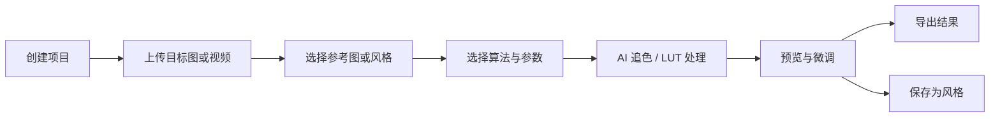
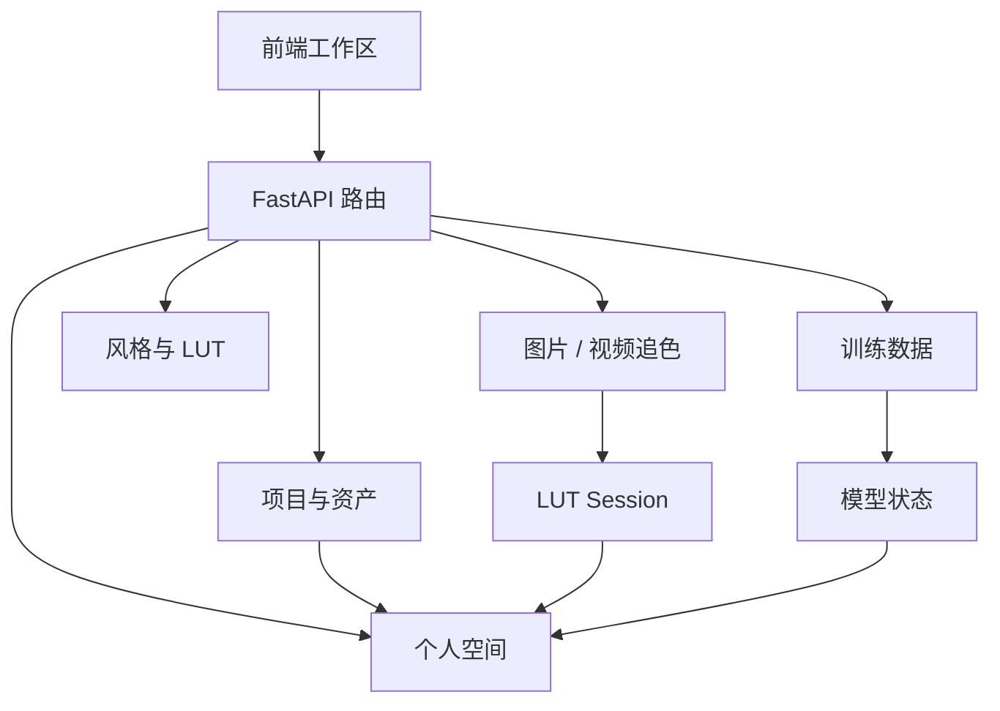

# ColorChase

ColorChase 是一个基于 FastAPI 的图像/视频追色与风格管理工具，集成经典颜色迁移、LUT、ModFlows、DNCM、NeuralPreset、Depth Anything V2、SAM2、BiRefNet、DINOv2 等能力，用于图片追色、视频追色、风格预设、训练样本管理和项目资产管理。

## 产品界面概览


## 核心工作流




## 数据与模块关系


## 功能使用教程

### 1. 登录与账户

1. 打开 `http://127.0.0.1:8000`。
2. 点击右上角登录入口。
3. 使用已注册账号登录，或按页面提示创建账号。
4. 登录后，系统会自动携带身份信息访问项目、个人空间、任务日志和训练数据功能。

### 2. 创建与管理项目

1. 进入首页或项目入口。
2. 新建图片项目或视频项目。
3. 上传的原图、参考图、追色结果、缩略图和视频结果会跟随项目保存。
4. 在项目历史中可以重新打开最近项目，继续查看或处理上一次的工作状态。
5. 删除项目时，项目关联的资产会一起清理。

### 3. 图片追色

图片追色用于把参考图或预设的色彩风格迁移到目标图。


基本流程：

1. 进入图片工作区。
2. 上传一张或多张目标图片。
3. 上传参考图，或选择内置风格/预设。
4. 选择追色算法：
   - 经典追色：适合轻量、快速处理。
   - ModFlows：适合更强的 AI 风格迁移。
   - NeuralPreset / DNCM：适合神经预设类调色流程。
   - 区域追色：适合需要区分主体、背景、肤色或局部区域的场景。
5. 点击开始追色。
6. 等待任务进度完成，查看结果预览。
7. 使用强度、亮度、对比、色彩等调整控件微调结果。
8. 点击导出或渲染完整结果。

常见建议：

- 参考图尽量选择曝光正常、风格明确的图片。
- 目标图和参考图如果场景差异过大，可以降低追色强度。
- 人像场景可以优先尝试区域追色或主体相关功能。

### 4. 批量图片工作流

1. 点击上传图片，可以一次选择多张目标图。
2. 左侧栏会显示图片列表和缩略图。
3. 点击任意图片切换当前处理对象。
4. 对当前图片完成追色后，可继续切换下一张处理。
5. 项目会保存图片列表、结果路径和必要的工作状态。

### 5. 视频追色

视频追色用于将图片参考风格应用到视频。

基本流程：

1. 进入视频工作区。
2. 上传视频文件，或选择已有视频路径。
3. 上传参考图片。
4. 选择视频追色算法和输出参数。
5. 点击开始视频追色。
6. 系统会抽帧、逐帧处理并重新合成视频。
7. 完成后可预览或导出结果视频。

视频导出：

1. 视频处理完成后，进入导出区域。
2. 选择导出格式、编码和质量参数。
3. 点击导出视频。
4. 完成后下载生成的 MP4 或对应格式文件。

### 6. LUT 与风格管理

风格管理用于保存、查看、重命名和复用调色风格。

可用操作：

1. 查看风格列表：进入风格区域后自动加载已有风格。
2. 查看单个风格：点击风格项，读取风格信息和预设路径。
3. 重命名风格：选择风格后修改名称并保存。
4. 应用风格：选择目标图和风格，生成追色预览。
5. 合并 LUT：选择两个 LUT session，将两个调色效果合并为新的 session。
6. 导出 Lightroom 预设包：上传或准备 XMP 后生成 DNG/XMP zip 包。

使用建议：

- 常用风格可以保存为预设，后续直接应用。
- 合并 LUT 适合把 AI 追色结果和人工风格预设叠加。
- Lightroom 预设导出适合把 ColorChase 风格转移到外部修图流程。

### 7. 景深、语义与主体分析

分析功能用于辅助区域追色和更精细的图像处理。

主要能力：

1. 景深分层：识别画面不同深度区域。
2. 语义匹配：根据图像内容做语义相似区域匹配。
3. 主体遮罩：识别人物或主体区域。

使用方式：

1. 在支持区域处理的工作流中上传目标图。
2. 选择对应分析功能。
3. 等待分析完成。
4. 将生成的 depth、mask 或 semantic 结果用于后续追色或局部调整。

### 8. 模型训练

训练模块用于维护 NeuralPreset 等模型相关训练数据。


上传训练数据：

1. 进入模型训练页面。
2. 在 `Training Dataset` 模块中点击 `Upload Images` 上传单张或多张图片。
3. 点击 `Upload Folder` 可以选择文件夹，系统会递归扫描子文件夹中的图片。
4. 页面会显示训练数据数量和占用大小。
5. 点击 `Refresh` 重新读取当前训练数据统计。
6. 点击 `Clear Data` 清除当前训练数据目录中的上传图片。

训练参数：

1. 选择训练阶段。
2. 设置训练数据目录、epochs、batch size 和学习率。
3. 点击开始训练。
4. 在训练状态区域查看进度和日志。
5. 训练完成后刷新模型状态，确认模型是否就绪。

注意：

- 文件夹上传会保留子文件夹分组信息，便于在页面检查样本质量。
- 非图片文件会被跳过。
- 超过上传大小限制的文件会被跳过并显示统计。

### 9. 个人空间

个人空间用于查看当前账号自己的项目、任务、资源和偏好。


包含内容：

1. 个人资料：昵称、头像、账号信息、最近登录。
2. 核心数据：操作任务、导出次数、项目数、创作效率。
3. 趋势图：近 7 日任务和导出趋势。
4. 资源与资产：原图数量、参考图数量、导出占用、存储使用。
5. 任务中心：最近任务状态、失败原因、快捷操作。
6. 模型与偏好：常用模型、最近模型、默认导出参数。
7. 项目与历史记录：最近项目、最近导出、最近训练/调用。

刷新机制：

- 点击右上角刷新按钮会立即更新。
- 页面会按自动刷新时间重新读取数据。
- 存储使用会跟随刷新重新计算。

### 10. 管理后台

管理员账号可以查看更完整的系统状态。

常用功能：

1. 总览系统任务、模型、训练数据和存储情况。
2. 查看任务日志中心，筛选失败或异常任务。
3. 查看模型状态，确认模型是否就绪。
4. 调整模型启用/禁用状态和默认模型。
5. 查看上传、训练、导出等资源统计。

建议：

- 上线前先检查模型状态和上传限制。
- 出现任务失败时，优先查看任务日志中心。
- 修改默认模型后，建议执行一次小图追色冒烟测试。

### 11. 推荐使用流程

图片追色推荐流程：

1. 新建图片项目。
2. 上传目标图。
3. 上传参考图或选择风格。
4. 选择算法并开始追色。
5. 微调强度和色彩参数。
6. 保存风格或导出结果。

视频追色推荐流程：

1. 新建视频项目。
2. 上传源视频。
3. 上传参考图。
4. 启动视频追色。
5. 检查预览结果。
6. 导出最终视频。

训练数据推荐流程：

1. 按主题整理本地训练图片文件夹。
2. 使用 `Upload Folder` 一次导入。
3. 检查分组和样本数量。
4. 清理质量差的样本后刷新统计。
5. 设置训练参数并启动训练。

## 项目结构

```text
ColorChase/
├── main.py                      # FastAPI 入口，保留追色主流程和少量未拆分路由
├── auth.py                      # JWT 鉴权与 Cookie 配置
├── config.py                    # 路径常量、运行时目录、模型路径
├── database.py                  # SQLAlchemy async session
├── models.py                    # ORM 模型
├── progress.py                  # 任务进度管理
├── admin_runtime_metrics.py     # 运行时统计、任务日志
├── requirements.txt
├── .env.example
│
├── app/
│   ├── routes/                  # 已拆分路由
│   │   ├── auth.py
│   │   ├── projects.py          # 项目、个人空间、资产统计
│   │   ├── training.py          # 模型训练与训练数据上传
│   │   ├── task.py              # 任务暂停/恢复/取消、用户配置
│   │   ├── analysis.py          # 景深、语义、主体分析
│   │   ├── files.py             # 文件读取路由
│   │   ├── styles.py            # 风格列表、重命名、应用
│   │   ├── lut.py               # LUT 合并、Lightroom 预设导出
│   │   ├── video_export.py      # 视频导出、视频元数据
│   │   ├── admin.py             # 管理员概览
│   │   ├── admin_models.py      # 模型管理
│   │   ├── model_status.py      # 模型状态
│   │   ├── progress.py          # SSE 进度
│   │   └── style_capture.py     # 风格采集
│   ├── services/
│   │   ├── paths.py             # 路径解析、安全目录、项目资产
│   │   ├── auth_utils.py        # 请求 Token/用户解析
│   │   ├── model_management.py  # 模型启用、禁用、默认模型
│   │   ├── task_logging.py      # 任务日志写入
│   │   └── training_corpus.py   # 训练样本副本管理
│   ├── security.py              # 上传大小、频率限制、AI 并发限制
│   └── settings.py              # 环境、CORS/Host、时区
│
├── algorithms/                  # 算法实现
│   ├── color_transfer.py
│   ├── depth_layers.py
│   ├── semantic_match.py
│   ├── subject_mask.py
│   ├── dncm/
│   ├── neural_preset/
│   ├── neuralpreset/
│   ├── metrics/
│   └── video/
│
├── core/
│   ├── color/lut_ops.py         # LUT 计算
│   ├── io/image_utils.py        # 上传保存、OpenCV 读图、base64
│   ├── io/lut_session.py        # LUT session 落盘
│   ├── io/loaders.py
│   └── render/full_render.py
│
├── static/                      # 前端页面、JS、CSS、图片资源
├── deploy/                      # Nginx/Caddy 部署配置
├── docs/                        # 运行、结构、安全、GitHub 上传文档
├── scripts/                     # 维护脚本和 GitHub 预检脚本
├── tests/                       # 测试与 fixtures
└── presets/                     # 内置预设
```

## 运行时目录

默认运行时数据统一放在 `storage/` 下：

```text
storage/
├── cache/                       # model_management.json、运行时统计
├── logs/debug_output/           # 调试输出
├── projects/assets/             # 项目资产
├── styles/extracted/            # 风格抽取结果
├── temp/luts/                   # LUT/session 临时文件
├── temp/frames/                 # 视频抽帧临时文件
├── training/corpus/             # 训练数据
├── uploads/images/              # 非项目图片上传
├── uploads/videos/              # 非项目视频上传
├── users/local_user/            # 本地用户资源
└── videos/                      # 非项目视频结果
```

这些目录属于运行时数据，默认被 `.gitignore` 排除。

## 本地开发

建议使用 Python 3.10 或 3.12，并优先使用虚拟环境。

```bash
python -m venv .venv312
.venv312\Scripts\activate
pip install -r requirements.txt
```

复制环境变量模板：

```bash
copy .env.example .env
```

必须设置：

```env
COLORCHASE_SECRET_KEY=replace-with-a-long-random-secret
COLORCHASE_ENV=development
```

启动服务：

```bash
python main.py
```

默认监听：

```text
http://127.0.0.1:8000
```

也可以直接使用 uvicorn：

```bash
uvicorn main:app --host 127.0.0.1 --port 8000
```

## 关键环境变量

| 变量 | 说明 |
|---|---|
| `COLORCHASE_ENV` | `development` 或 `production` |
| `COLORCHASE_SECRET_KEY` | JWT 密钥，必须设置 |
| `COLORCHASE_ALLOWED_ORIGINS` | 生产 CORS 白名单 |
| `COLORCHASE_ALLOWED_HOSTS` | 生产 Host 白名单 |
| `COLORCHASE_UPLOAD_MAX_BYTES` | 通用上传限制 |
| `COLORCHASE_IMAGE_ORIGINAL_UPLOAD_MAX_BYTES` | 原图/训练图上传限制 |
| `COLORCHASE_VIDEO_UPLOAD_MAX_BYTES` | 视频上传限制 |
| `COLORCHASE_UPLOAD_RATE_LIMIT` | 上传频率限制 |
| `COLORCHASE_AI_RATE_LIMIT` | AI 请求频率限制 |
| `COLORCHASE_GLOBAL_AI_CONCURRENCY` | 全局 AI 并发 |
| `COLORCHASE_USER_AI_CONCURRENCY` | 单用户 AI 并发 |
| `COLORCHASE_ENABLE_LOCAL_ADMIN_TOOLS` | 本地管理员工具开关，生产默认关闭 |
| `COLORCHASE_NEURALPRESET_ROOT` | 可选，NeuralPreset 源目录 |

## 验证命令

常用轻量验证：

```bash
python -m py_compile main.py
python -m py_compile app/routes/projects.py app/routes/training.py app/security.py
node --check static/js/router.js
```

启动验证：

```bash
uvicorn main:app --host 127.0.0.1 --port 8000
```

GitHub 上传前预检：

```bash
python scripts/github_preflight.py
```

预检脚本会检查分支状态、工作区状态和仓库体积。

## 生产部署建议

推荐部署方式：

- 应用：`uvicorn main:app --host 127.0.0.1 --port 8000`
- 进程管理：systemd
- 反向代理：Nginx 或 Caddy
- HTTPS：Let's Encrypt
- 数据目录：部署机本地 `storage/`

Nginx 与 Caddy 模板位于：

```text
deploy/nginx-colorchase.conf
deploy/Caddyfile
```

SSE 进度接口依赖流式响应，反代必须关闭 buffering。上传上限也要和 `.env` 中的上传限制保持一致。
